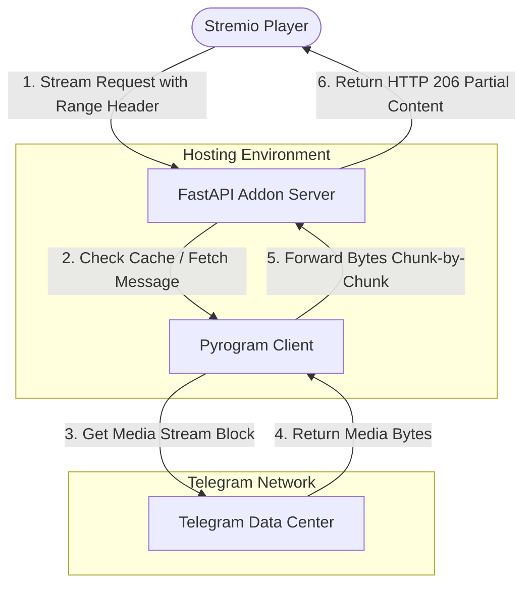

# Telegram Stremio Addon


[](LICENSE)
[](https://github.com/SunilRoy-dev/stremio-telegram-debrid/stargazers)
[](https://github.com/SunilRoy-dev/stremio-telegram-debrid/network/members)


Stream video, audio, and subtitle files directly from your private Telegram storage channels inside Stremio. This addon serves as a high-speed on-the-fly streaming HTTP proxy (fully supporting Range Requests for instant seek/scrubbing) that integrates your private Telegram channel into your personal Stremio library.

### Why I built this
I store my personal media files on a private Telegram channel. I wanted a way to play them directly on my TV through Stremio without paying for Debrid links or downloading the files first. Other tools I found required setting up complex external databases like MongoDB, so I wrote this lightweight, database-free Python script to serve as a fast streaming proxy with subtitle loading and instant skipping.

Contributions and bug reports are welcome! If you encounter issues, feel free to open a GitHub Issue, or submit a Pull Request with your improvements. All pull requests will be reviewed and merged accordingly.

> [!NOTE]
> **Show Your Support!** ⭐
> If you find this project useful, please **leave a star on the repository** before you fork, clone, or deploy it. Your stars help keep this project active and maintained!

---

## 🚀 Quick Start (For Beginners)

Here is a simplified step-by-step roadmap to get the addon running on your phone or computer in less than 5 minutes:

| Step | Action | Where to do it |
| :--- | :--- | :--- |
| **1. Fork the Project** | Click **Fork** at the top of this GitHub repository to copy it to your own GitHub account. | GitHub (this webpage) |
| **2. Get Keys** | Go to [my.telegram.org](https://my.telegram.org) and generate your 'API_ID' and 'API_HASH' keys. | Telegram Website |
| **3. Get Session** | Run the Python script on [Computer](#how-to-generate-user_session_string-locally) or [Mobile](#how-to-generate-user_session_string-on-mobile-no-computer-needed) to get your 'USER_SESSION_STRING'. | Local computer or Mobile Phone |
| **4. Deploy** | Create a free account on Hugging Face and launch a Docker Space (see the [Hugging Face Space Setup Guide](#hugging-face-spaces-setup-guide)). Enter your variables in the Space settings (see the [Channel Configuration Guide](#configuring-channels-private-and-public)). | Hugging Face Website |
| **5. Install** | Copy the manifest URL of your deployed Space and paste it into the 'Add-ons' section of Stremio (see the [Stremio Installation Guide](#how-to-install-in-stremio)). | Stremio App |

---

## One-Click Deploy & Setup Options

Deploy your own instance of the Telegram Stremio Addon instantly using any of the services below:

| Platform | Deployment Type / Limitations | Deploy Button |
| :--- | :--- | :--- |
| **Hugging Face Spaces** | Free CPU Tier (Highly Recommended — Generous Bandwidth / Sleeps after 48h) | [Manual Setup Guide](#hugging-face-spaces-setup-guide) |
| **Render** | Free Hobby Tier (5GB Bandwidth Limit & Auto-Sleeps) | [](https://render.com/deploy?repo=https://github.com/SunilRoy-dev/stremio-telegram-debrid) |
| **Koyeb** | Free Edge Tier (Continuous — Requires Card Verification) | [](https://app.koyeb.com/deploy?type=git&repository=github.com/SunilRoy-dev/stremio-telegram-debrid&branch=main&name=stremio-telegram-debrid) |
| **Railway** | Trial Tier (Limited Credits, approx. 500 hours/month) | [](https://railway.app/new/template?template=https://github.com/SunilRoy-dev/stremio-telegram-debrid) |
| **Zeabur** | Trial Tier (Limited Credits) | [](https://zeabur.com/templates/deploy?template=https://github.com/SunilRoy-dev/stremio-telegram-debrid) |

*Please read the **[Deployment Platform Specs and Limitations](#deployment-platform-specs-and-limitations)** section below before selecting a hosting provider.*

---

## Key Features

- **Search & Match Integration**: Search for any video or media title in Stremio; the addon automatically scans your Telegram channel for matching file names and serves them instantly as stream sources.
- **Debrid Cache Integration**: Stream public torrent files instantly via **Real-Debrid** or **TorBox** (uses HTTP 302 Redirect directly to Debrid CDNs to bypass local bandwidth limits). See [DEBRID_GUIDE.md](DEBRID_GUIDE.md).
- **Free qBittorrent Streaming**: Stream torrent files on-the-fly sequentially while qBittorrent downloads them locally. See [QBITTORRENT_GUIDE.md](QBITTORRENT_GUIDE.md).
- **Telegram Upload Auto-Cache**: Automatically upload completed torrents from Debrid or qBittorrent to your private Telegram channel in the background, keeping a permanent free backup.
- **Stitched Split Streaming**: Automatically groups, merges, and streams multi-part file archives (such as `.001`, `.part1` patterns) as one continuous virtual stream.
- **ZIP Archive Streaming**: Automatically scans, lists, and streams video files nested inside standard ZIP archives or split ZIP files (e.g., '.zip.001', '.zip.002', etc.) on the fly.
- **Smart Segment Filtering**: Intelligently parses naming patterns and number sequences (e.g. Part 1, Part 2, V1, V2) from filenames to retrieve and stream only the exact segmented file requested.
- **Subtitle Auto-Mapping**: Automatically scans your channel for matching subtitle files (SRT, VTT, ASS), injects them, and auto-detects English, Spanish, and French tracks.
- **High-Speed Range Proxy**: Supports HTTP `206 Partial Content` streaming, enabling instant scrub/seek (fast-forwarding/rewinding) on players like ExoPlayer, VLC, and MPV (for direct files and stitched split streams).
- **Zero-Storage Footprint**: Streams files chunk-by-chunk in memory directly from Telegram DCs. No temporary server storage is consumed (except for temporary torrent caches if auto-upload is enabled).
- **Secure Access Control**: Protects your endpoints using an optional API key query (`?api_key=...`) to prevent unauthorized access.
- **Custom Logging**: Log streaming activity directly back to a separate private Telegram channel.

---

## Stitched Split Streaming

If you have large media files (e.g., 4K HDR video backups) that exceed Telegram's file upload limits (2GB for bots, 4GB for user accounts), you can split them into smaller segments before uploading. The addon automatically detects, groups, and stitches them back together into a single virtual stream.

### Supported Split Formats
The addon parses standard split archive conventions including:
* **Numeric extensions**: `Video.mkv.001`, `Video.mkv.002`, `Video.mkv.003`...
* **Part indicators**: `Video.part1.rar`, `Video.part2.rar`, `Video.part3.rar`... (or `.part01.mkv`, `.part02.mkv`...)
* **Suffix delimiters**: `Video_part_1.mp4`, `Video_part_2.mp4`...

### How It Works Under the Hood
1. **Aggregation**: The catalog handler parses filename patterns and clusters split files together, presenting them as a single item with their total combined file size (e.g., `Stitch stream | 6.2 GB`).
2. **Dynamic Range Mapping**: When you press play or seek in Stremio, the addon maps the player's byte-range requests to the respective split files on the fly.
3. **In-Memory Sequential Access**: It downloads only the necessary segments from Telegram DCs and transitions between split messages seamlessly in memory, resulting in uninterrupted playback.

---

## ZIP File Support

You can upload a '.zip' file (or a split ZIP like '.zip.001', '.zip.002', etc.) to your Telegram channel. The addon will automatically look inside the ZIP, find all the video files, and list them in Stremio so you can play them directly!

### ⚠️ Important: Skipping/Seeking does NOT work for ZIPs
> [!IMPORTANT]
> **You cannot skip forward or rewind when playing videos that are inside ZIP files.**
> - **Why?** To skip to a certain part of a video inside a ZIP file, the server has to download and unpack the ZIP file from the very beginning up to that point. For large media files, this takes too much time, and your Stremio player will freeze or disconnect.
> - **Easy Fix**: If you want to skip/seek through your videos, **do not upload them in a ZIP file**. Upload them **directly as video files ('.mp4', '.mkv', etc.)** or as split video files ('.001', '.002', etc.), and seeking will work perfectly!


## 📂 Naming and Matching Guide

To make sure the addon successfully finds your files and matches them perfectly when you play them, name your files or write your Telegram message captions using this simple format:

"
[Title Name] [Season/Episode Info] [Any Extra Tags].extension
"

### 3 Simple Rules to Follow:

1. **Rule 1: Put the Title at the Very Start**
   - The exact name of your show or video must be the first thing in the filename or caption. 
   - Case-insensitive (e.g., 'Show Name' or 'show name' are both fine).
   - Spaces, dots, or dashes are all supported (e.g., 'Show Name' or 'Show.Name').

2. **Rule 2: Put the Season and Episode Info Right After the Title**
   - This helps the system identify which episode you are selecting.
   - You can write this in almost any style:
     - **Standard**: 'S01E02', 's1e2', 's01.e02', '1x02', '01x02'
     - **Plain Text**: 'Season 1 Episode 2', 'Season01 Episode02'
     - **Spanish / Latino**: 'Temporada 1 Capitulo 2', 'temp 2 cap 5', 't1 c2'
     - **Reverse (Episode first)**: 'e2-s1', 'e2xs1', 'episode 2 season 1', 'chapter two season one'
     - **Standalone Episode** (no season): 'Ep 23', 'capitulo 5', '[05]', '- 02 -' (this defaults to Season 1)

3. **Rule 3: Put Everything Else at the Very End**
   - Put extra details like resolution, audio type, or download group links 'after' the season and episode (e.g., 'Show Name S01E01 [1080p] [Dual Audio].mkv').
   - This ensures that tags or promotional text do not confuse the search system.

---

## System Architecture

The diagram below shows how the addon behaves as a range-supported streaming proxy between Stremio and Telegram:



---

## Configuration Environment Variables

Configure these settings in your deployment dashboard or local `.env` file:

| Variable | Required | Description |
| :--- | :---: | :--- |
| `API_ID` | **Yes** | Your Telegram API ID from [my.telegram.org](https://my.telegram.org). |
| `API_HASH` | **Yes** | Your Telegram API Hash from [my.telegram.org](https://my.telegram.org). |
| `TELEGRAM_CHANNEL_ID` | **Yes** | Comma-separated list of private/public channel IDs or usernames (e.g. -1001234567890, @my_channel). |
| `BOT_TOKEN` | **Conditional** | Bot Token from `@BotFather` (required if `USER_SESSION_STRING` is not configured). |
| `USER_SESSION_STRING` | **Conditional** | Pyrogram Session String (highly recommended to bypass bot limits, see details below). |
| `API_KEY` | No | Add a secret key (e.g. `mykey123`) to secure your addon endpoint with `?api_key=mykey123`. |
| `ADDON_URL` | **Yes** | The public HTTP URL where your server is deployed (e.g. `https://myaddon.onrender.com`). |
| `LOG_CHANNEL_ID` | No | Telegram channel ID where play/stream logs are recorded. |
| `TIMEZONE` | No | Timezone for logs (e.g., `Asia/Kolkata`, `UTC+05:30`). Defaults to `UTC`. |
| `CACHE_TTL` | No | Cache duration in seconds for searches (default: `1800` [30 mins]). |

---

## Telegram Credentials: Bot vs. User Sessions

You can run this addon using either a standard Telegram Bot Token or a Pyrogram User Session String. Review the differences below:

### 1. Telegram Bot (Bot Token)
- **Drawback/Limit**: Telegram imposes a strict **2GB size limit** on all files uploaded/downloaded by bots. Any file in your channel larger than 2GB **will fail to stream**.
- **Setup**: Must make the bot an **Administrator** in your private channel so it has permissions to search channel history.

### 2. User Client (User Session String)
- **Benefit**: Bypasses the bot limit, allowing you to stream files up to **4GB** (the maximum file size for all standard Telegram accounts).
- **Setup**: Needs only standard member access to private channels.

> [!CAUTION]
> **Security Warning regarding `USER_SESSION_STRING`**
> A Pyrogram User Session String grants **complete access** to your Telegram account. Anyone who acquires this string can read, write, or delete messages in your personal chats and channels.
> - **Never** hardcode this string in files or push it to public repositories.
> - **Only** enter it as a secure secret environment variable on trusted hosting platforms (Render, Koyeb, Railway, etc.).
> - **Always** generate the session string on your trusted local computer.

### How to Generate 'USER_SESSION_STRING' Locally

Run the following command in your terminal to safely generate and export your session string:

```bash
python -c "
import asyncio
from pyrogram import Client
api_id = int(input('API ID: '))
api_hash = input('API HASH: ')
async def main():
    async with Client('temp_session', api_id, api_hash) as app:
        print('\nYour USER_SESSION_STRING is:\n')
        print(await app.export_session_string())
        print('\nCopy the string completely.')
async def run():
    try:
        await main()
    except Exception as e:
        import traceback
        traceback.print_exc()
asyncio.run(run())
"
```

### How to Generate 'USER_SESSION_STRING' on Mobile (No Computer Needed)

If you do not have a computer, you can safely generate your session string directly on your mobile phone:

#### Option A: Android (using Pydroid 3 App - Easiest & 100% Offline)
1. Install **Pydroid 3 - IDE for Python 3** from the Google Play Store.
2. Open the app, tap the menu (three lines in top-left), select **Pip**, search for `pyrogram tgcrypto`, and tap **Install**.
3. Go back to the main editor screen and paste the following Python script:
   ```python
   import asyncio
   from pyrogram import Client
   api_id = int(input('API ID: '))
   api_hash = input('API HASH: ')
   async def main():
       async with Client('temp_session', api_id, api_hash) as app:
           print('\nYour USER_SESSION_STRING is:\n')
           print(await app.export_session_string())
   asyncio.run(main())
   ```
4. Tap the yellow **Play** button. A terminal window will open—enter your API ID, API Hash, phone number (with country code, e.g. +1234567890), and the login code sent to your Telegram app.
5. Copy the generated string from the screen.

#### Option B: Web Browser (using Google Colab - No App Install Needed)
1. Open **Google Colab** in your mobile browser: [colab.new](https://colab.new) (log in with your Google account).
2. Tap '+ Code' to add a new cell, paste the following code, and tap the **Play** button to run it:
   ```python
   !pip install pyrogram tgcrypto
   import asyncio
   from pyrogram import Client
   api_id = int(input('API ID: '))
   api_hash = input('API HASH: ')
   async def main():
       async with Client('temp_session', api_id, api_hash) as app:
           print('\nYour USER_SESSION_STRING is:\n')
           print(await app.export_session_string())
   await main()
   ```
3. Enter your details and phone authentication code inside the prompt fields that appear.
4. Copy the generated string completely.

---

## Configuring Channels (Private and Public)

You can configure the addon to index media from multiple channels (both private and public).

## Channel Formats in 'TELEGRAM_CHANNEL_ID'
* **Private Channels**: Use their numeric IDs (e.g. -1001234567890).
* **Public Channels**: Use their public usernames with or without the '@' symbol (e.g. '@public_channel' or 'public_channel').
* **Multi-Channel Configuration**: Separate them with commas (e.g. 'TELEGRAM_CHANNEL_ID=-1001234567890, @my_public_channel, other_public_channel').

### Access & Membership Requirements
* **Standard Telegram Bot ('BOT_TOKEN')**: The bot **must** be added to the channel as a member or administrator so it has permission to query and read chat history.
* **User Session Client ('USER_SESSION_STRING')**: The user account must be joined or subscribed to the channels so Pyrogram can search and resolve the files.

### Recommended Limits
While the config accepts any number of channels, it is highly recommended to limit your list to **5 to 10 channels max**. 
* **Performance**: The addon queries each channel sequentially. Too many channels will cause Stremio to timeout (expecting responses in 3-5 seconds).
* **Telegram Rate Limits**: Searching across too many channels simultaneously may trigger Telegram's 'FloodWait' warnings.

---

## Deployment Platform Specs and Limitations

Read these limitations carefully to choose the hosting platform that best fits your requirements:

### 1. Hugging Face Spaces

Hugging Face Spaces is the recommended hosting platform as it provides fast networking, stable CPU environments, and does not require credit card verification.

* **Drawbacks & Security Warnings**:
  - **Generous Bandwidth**: Unlike Render's strict 5GB limit, Hugging Face does not enforce a rigid monthly bandwidth quota on free Spaces. This makes it the highly preferred platform for streaming video backups without hitting quota limits.
  - **Public Repos Only**: Free Spaces must be configured as **Public** to run. Private spaces require a paid subscription. Because your Space is public, **never upload your `.env` file to the files section**. Instead, add your configuration keys in your Space **Settings > Variables and Secrets** as secrets.
  - **⚠️ Illegal Activity Termination Policy**: Hugging Face strictly enforces its Acceptable Use Policy. Hosting copyrighted or unauthorized media files for public streaming will lead to **immediate Space deletion, permanent account termination, and potential legal notices/liability** from content owners. Only stream video files you legally own or have permission to access.
  - **Auto-Sleep**: Auto-sleeps after **48 hours** of inactivity. However, it wakes up within **10-15 seconds** of a new request, which is significantly faster than Render.

#### Hugging Face Spaces Setup Guide

The addon can be deployed on Hugging Face Spaces in less than 5 minutes. You can also configure it to **automatically update** whenever new fixes are pushed to GitHub!

1. **Fork this Repository**: 
   - Click the **Fork** button at the top-right of this GitHub page to copy it to your own GitHub account.
2. **Create a Hugging Face Account**: 
   - Visit [Hugging Face](https://huggingface.co/) and sign up for a free account.
3. **Create a New Space**: 
   - Go to [huggingface.co/new-space](https://huggingface.co/new-space).
   - **Space Name**: Choose any name (e.g., 'stremio-telegram-addon').
   - **Space SDK**: Select **Docker**.
   - **Template**: Select **Blank**.
   - **Space Visibility**: Make sure it is set to **Public** (required for the free tier).
   - Click **Create Space** at the bottom.
4. **Upload Your Code to the Space**:
   - Go to your new Space page and click the **Files** tab at the top.
   - Click **+ Add file** > **Upload files**.
   - On your GitHub fork, click the green **Code** button and select **Download ZIP**. Extract the ZIP on your device.
   - Upload all the extracted files into the upload area on Hugging Face. Make sure 'Dockerfile', 'addon.py', 'requirements.txt', and all other project files are uploaded to the root of the Space (not inside a subfolder).
   - Click **Commit changes to main**. Hugging Face will automatically start building and deploying your Space!
5. **Configure Environment Secrets**: 
   - Click the **Settings** tab at the top of your Space page.
   - Scroll down to **Variables and secrets** and click **New secret** to add your settings:
     - 'API_ID' (from my.telegram.org)
     - 'API_HASH' (from my.telegram.org)
     - 'BOT_TOKEN' (or 'USER_SESSION_STRING')
     - 'TELEGRAM_CHANNEL_ID'
     - 'API_KEY' (a password of your choice to protect your addon link)
     - 'ADDON_URL': Set this to 'https://<your-hf-username>-<your-space-name>.hf.space' (you can find this URL by clicking "Embed this Space" in the top-right of your Space page).
     - 'AUTO_UPDATE': (Optional) Set to 'true' if you want the Space to automatically download the latest version of the code from GitHub on startup. Set to 'false' or leave it unset to use the static uploaded files.
     - 'GITHUB_REPO_URL': (Optional) If you set 'AUTO_UPDATE' to 'true' and want to pull from your own custom GitHub fork, enter your fork URL here (e.g., 'https://github.com/yourusername/stremio-telegram-debrid.git').
6. **How to Update in the Future**:
   - If you set 'AUTO_UPDATE' to 'true', you never have to re-upload files when new updates are released! Simply go to your Space **Settings** tab and click **Restart Space** (or **Factory Restart**), and it will automatically pull the latest code on startup.
   - If 'AUTO_UPDATE' is unset or 'false', you will need to manually re-upload updated files to the Space.

Once the status bar at the top turns green and says **Running**, your addon is online!

### 2. Render
- **Cost**: Hobby/Free Tier. No credit card required at signup.
- **Drawbacks**: 
  - **⚠️ Bandwidth Limit (Strict 5GB/Month Outbound Limit)**: Render imposes a strict **5 GB limit** of free outbound bandwidth per month for web service apps (unlike static sites which get 100GB). Since video streaming is data-intensive, **you will hit this 5GB limit almost immediately**. If you exceed it without a credit card/billing configured, **Render will temporarily deactivate your service addon** (it will not ban your personal Render billing account, but the streaming proxy will stop working until the next billing cycle starts or you upgrade).
  - **Auto-Sleep**: The container spins down/goes to sleep after **15 minutes of inactivity**. If you haven't used Stremio for a while, opening a video will trigger a wakeup request. The container will take **1 to 2 minutes** to build/spin up, causing Stremio to show a connection error initially. Simply wait 60 seconds and try playing again.

### 3. Koyeb
- **Cost**: Free Tier. **Requires card verification at signup** (even though you won't be charged).
- **Drawbacks**:
  - The container stays continuously active (no auto-sleep), but you must verify your identity with a valid credit card during registration.
  - Limited to 1 free service per organization.

### 4. Railway
- **Cost**: Trial Tier. Provides $5 free credits (approx. 500 hours of continuous runtime per month).
- **Drawbacks**:
  - The service will run out of hours and stop working before the end of the month unless you upgrade to a developer account (which requires a card and charges on usage).

### 5. Zeabur
- **Cost**: Trial Tier. Limited credits.
- **Drawbacks**:
  - Similar to Railway, has a limited free trial tier or resource caps.

---

## Local Installation & Setup

### Prerequisites
- Python 3.10 or higher.
- (Optional but highly recommended) Cryptography speedup library:
  - **TgrCrypto** (Recommended for Python 3.12+ / to avoid compiler setup): Rust-powered drop-in replacement with precompiled wheels. No compiler tools needed!
  - **tgcrypto** (Original library, supports up to Python 3.11 precompiled): Requires system compiler tools if building from source on newer Python versions:
    - **Windows**: Build Tools for Visual Studio.
    - **Linux**: `build-essential libssl-dev python3-dev`
    - **macOS**: Xcode Command Line Tools.

### Option A: Python Setup
1. Clone the repository:
   ```bash
   git clone https://github.com/SunilRoy-dev/stremio-telegram-debrid.git
   cd stremio-telegram-debrid
   ```
2. Create a virtual environment and activate it:
   ```bash
   python -m venv .venv
   # Windows:
   .venv\Scripts\activate
   # Linux/macOS:
   source .venv/bin/activate
   ```
3. Install dependencies:
   - **For Python 3.12+** (or if you don't have C++ Build Tools):
     ```bash
     pip install -r requirements.txt TgrCrypto
     ```
   - **For Python 3.10/3.11** (or if you already have C++ compilers):
     ```bash
     pip install -r requirements.txt tgcrypto
     ```
4. Create a `.env` file in the root folder using your credentials (refer to the [Configuration Variables](#configuration-environment-variables) section).
5. Run the server:
   ```bash
   python addon.py
   ```
   The landing configuration page will be accessible at `http://localhost:7860`.

### Option B: Docker Compose
Build and start the container using Docker Compose:
```bash
docker-compose up --build
```

### Option C: Self-Hosting on VPS (Viren070's Docker Template)

If you self-host your addons using [Viren070/docker-compose-template](https://github.com/Viren070/docker-compose-template), you can deploy this addon in 3 simple steps:

#### Step 1: Create the App Folder and Files
On your VPS, navigate to your cloned `docker-compose-template` directory (typically `/opt/docker`) and run the following command to create the directory and download our pre-configured `compose.yaml`:
```bash
mkdir -p apps/stremio-telegram-debrid
curl -s https://raw.githubusercontent.com/SunilRoy-dev/stremio-telegram-debrid/main/deployment/vps/compose.yaml -o apps/stremio-telegram-debrid/compose.yaml
```

Or you can create the file `apps/stremio-telegram-debrid/compose.yaml` manually with the following configuration:
```yaml
services:
  stremio-telegram-debrid:
    container_name: stremio-telegram-debrid
    image: ghcr.io/sunilroy-dev/stremio-telegram-debrid:latest
    restart: unless-stopped
    env_file:
      - .env
    environment:
      - PORT=7860
    profiles:
      - stremio-telegram-debrid
      - debrid
      - addon
    networks:
      - traefik
    labels:
      - "traefik.enable=true"
      - "traefik.http.routers.stremio-telegram-debrid.rule=Host('stremio-tg.${DOMAIN}')"
      - "traefik.http.routers.stremio-telegram-debrid.entrypoints=websecure"
      - "traefik.http.routers.stremio-telegram-debrid.tls.certresolver=letsencrypt"
      - "traefik.http.services.stremio-telegram-debrid.loadbalancer.server.port=7860"

  stremio-telegram-debrid-updater:
    container_name: stremio-telegram-debrid-updater
    image: containrrr/watchtower
    restart: unless-stopped
    volumes:
      - /var/run/docker.sock:/var/run/docker.sock
    command: stremio-telegram-debrid --cleanup --interval 300
    profiles:
      - stremio-telegram-debrid
      - debrid
      - addon

networks:
  traefik:
    external: true
```

> [!TIP]
> **Already running Watchtower?**
> If you already have a global Watchtower container running (e.g., from Viren070's template), you can safely omit/delete the `stremio-telegram-debrid-updater` service block from your `compose.yaml` file to avoid running redundant container update processes.

#### Step 2: Configure the App Environment Variables
Create a file named `apps/stremio-telegram-debrid/.env`. You can download our sample `.env.example` template directly by running:
```bash
curl -s https://raw.githubusercontent.com/SunilRoy-dev/stremio-telegram-debrid/main/.env.example -o apps/stremio-telegram-debrid/.env
```
Or create it manually and configure your credentials:
```env
# Telegram Credentials
API_ID=your_api_id
API_HASH=your_api_hash
TELEGRAM_CHANNEL_ID=-100xxxxxxxxxx

# Choose one: Use either User Session (recommended) or Bot Token
USER_SESSION_STRING=your_session_string
BOT_TOKEN=your_bot_token

# Addon Settings
API_KEY=your_addon_api_key
ADDON_URL=https://stremio-tg.yourdomain.com
```
*(Replace `yourdomain.com` with your actual domain)*

#### Step 3: Register and Run the Addon
1. Open the **root `compose.yaml`** file at the root of your `docker-compose-template` directory, and add our app path under the `include:` section:
   ```yaml
   include:
     # ... existing apps ...
     - apps/stremio-telegram-debrid/compose.yaml
   ```
2. Open the **root `.env`** file at the root of your template, and ensure `addon` is included in your `COMPOSE_PROFILES` so it starts automatically:
   ```env
   COMPOSE_PROFILES=required,addon
   ```
3. Start the addon by running:
   ```bash
   docker compose up -d
   ```


## How to Install in Stremio

1. Deploy the addon publicly (or run it locally with tunnel software like Ngrok).
2. Copy your addon manifest URL (e.g., `https://your-addon-domain.com/manifest.json?api_key=mykey`).
3. Open **Stremio** (Desktop, Mobile, or Web).
4. Go to **Add-ons**, paste the URL into the search bar, and click **Install**.
5. Search for your video backups in Stremio. If matching files exist in your Telegram channel, you will see the stream option labeled `▶ TG Play` or `▶ TG Channel` at the top of the streams panel!

---

## Contributing

Contributions, bug reports, and suggestions are highly welcome!
- **Report Issues**: If you find bugs or want to request features, please open a GitHub Issue.
- **Submit Pull Requests**: Feel free to fork the repository, make improvements, and submit a Pull Request. All pull requests will be reviewed and merged to improve the project.

---

## Built With & Credits

This project is made possible thanks to the following open-source frameworks, libraries, and APIs:

- **[FastAPI](https://fastapi.tiangolo.com/)**: High-performance, easy-to-use Python web framework for building the addon routes.
- **[Pyrogram](https://github.com/pyrogram/pyrogram)**: Elegant, modern, and asynchronous Telegram MTProto API framework, powering our connection to Telegram channels.
- **[tgcrypto](https://github.com/pyrogram/tgcrypto)**: High-speed C-extension for Pyrogram cryptography requirements to ensure smooth streaming.
- **[Uvicorn](https://www.uvicorn.org/)**: Lightning-fast ASGI web server implementation.
- **[Cinemeta API](https://github.com/Stremio/stremio-cinemeta)**: Stremio's default metadata provider, enabling the addon to query and match filenames.

---

## License, Attribution and Stars

### MIT Non-Commercial License (MIT-NC)
This project is licensed under a custom **MIT Non-Commercial License (MIT-NC)** - see the [LICENSE](LICENSE) file for details. Copyright (c) 2026 SunilRoy.

Sublicensing, commercial sale, renting, or financial/monetary exploitation of this software (including its source code and derivatives) is **strictly prohibited**.

### What happens if someone violates the license or removes attribution?
By hosting public code, you are protected by copyright laws. If someone forks or copies this repository and removes your attribution/links, sells/monetizes the software, or uses it in violation of the non-commercial terms, **you have the legal right to file a DMCA Takedown Notice**. 

GitHub, Render, Koyeb, and other major platforms take copyright violations very seriously. Filing a formal DMCA notice through their portals will result in their repository, fork, or hosted service being **disabled or taken down** within 24 hours.

### Attribution Requirement
If you fork, copy, modify, or redistribute this project:
1. You **must** keep the original credits back to [SunilRoy-dev](https://github.com/SunilRoy-dev).
2. Do **not** remove the developed-by credits or links from the web landing page footer, manifest metadata, or startup console banner.
3. Please **star the repository** as a sign of appreciation.

---

## Educational Disclaimer

> [!WARNING]
> This software is created solely for **educational, personal backup, and research purposes**. The author (`SunilRoy`) does not condone, promote, or encourage copyright infringement or the unauthorized streaming/sharing of copyrighted media. 
> - Users are solely responsible for the media files they host in their private Telegram channels.
> - By deploying or running this software, you agree that you are using it in compliance with all local copyright laws and terms of service.
